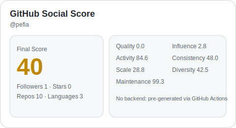

# GitHub Social Score

Production-ready, backend-free GitHub profile score cards that render in your profile `README.md` with **light/dark mode support**.

<picture>
  <source media="(prefers-color-scheme: dark)" srcset="./assets/social-score-dark.svg">
  <source media="(prefers-color-scheme: light)" srcset="./assets/social-score-light.svg">
  
</picture>

## Zero-setup usage (no profile repo files needed)

If you don't want to copy any scripts/workflows, just link to the hosted app directly from your profile README.

Use this markdown:

```md
[](https://githubsocialscore.github.io/?user=<your-username>)
```

That's it — one link, zero extra files in your profile repo.

You can also add a text link:

```md
🔎 Check my live GitHub Social Score: https://githubsocialscore.github.io/?user=<your-username>
```

## Why this project exists

GitHub READMEs cannot execute custom JavaScript widgets. This project solves that by generating static SVG cards from GitHub data and committing them, so they can be embedded anywhere Markdown images are supported.

## Features

- ✅ No backend required
- ✅ Light + dark mode cards
- ✅ Auto-updates with GitHub Actions
- ✅ Explainable multi-factor scoring model
- ✅ Profile README friendly (`<picture>` fallback)

## Quick start (for your profile repo)

> Use this in your profile repository named `<your-username>/<your-username>`.

1. Copy these files into your profile repo:
   - `scripts/generate-score-card.mjs`
   - `.github/workflows/update-score-card.yml`
2. Commit and push.
3. Add this embed block to your profile `README.md`:

```md
<picture>
  <source media="(prefers-color-scheme: dark)" srcset="./assets/social-score-dark.svg">
  <source media="(prefers-color-scheme: light)" srcset="./assets/social-score-light.svg">
  
</picture>
```

4. Run the workflow once from **Actions → Update Social Score Card → Run workflow**.

## Local usage

```bash
node scripts/generate-score-card.mjs --username=<your-username>
```

Optional (recommended for higher API limits):

```bash
GITHUB_TOKEN=ghp_xxx node scripts/generate-score-card.mjs --username=<your-username>
```

## Scoring model (v2)

Final score is a weighted blend of 7 dimensions:

- **20% Quality** (stars, forks, watchers)
- **20% Influence** (followers + project reach)
- **16% Activity** (recency-decayed push activity)
- **12% Consistency** (regularity of update cadence)
- **12% Scale** (non-fork repo count)
- **10% Diversity** (language breadth)
- **10% Maintenance** (open issue pressure)

Small bonus:
- **+2 points** if the account is marked hireable.

## Automation details

Workflow file: `.github/workflows/update-score-card.yml`

- Runs every 12 hours.
- Can be triggered manually.
- Uses `GITHUB_TOKEN` and `github.repository_owner` to generate cards for the profile owner.
- Commits updated SVG assets only when changes exist.

## Repo structure

```text
.
├── .github/workflows/update-score-card.yml
├── assets/
│   ├── social-score-dark.svg
│   └── social-score-light.svg
├── index.html
└── scripts/generate-score-card.mjs
```

## FAQ

### Does this need a server?
No. Assets are generated by script/workflow and committed as static SVG files.

### Why use `<picture>`?
It ensures the correct card variant is selected for light/dark system theme.

### What if rate limits are hit?
Use `GITHUB_TOKEN` locally; in GitHub Actions the provided token is already used.

## Contributing

PRs are welcome. Good next improvements:

- Theme presets (`classic`, `neon`, `minimal`)
- Multi-size output (`sm`, `md`, `lg`)
- Compare mode (two-user delta card)
- JSON export for static leaderboards

---

If you ship this on your profile, tag the project so others can discover it.
